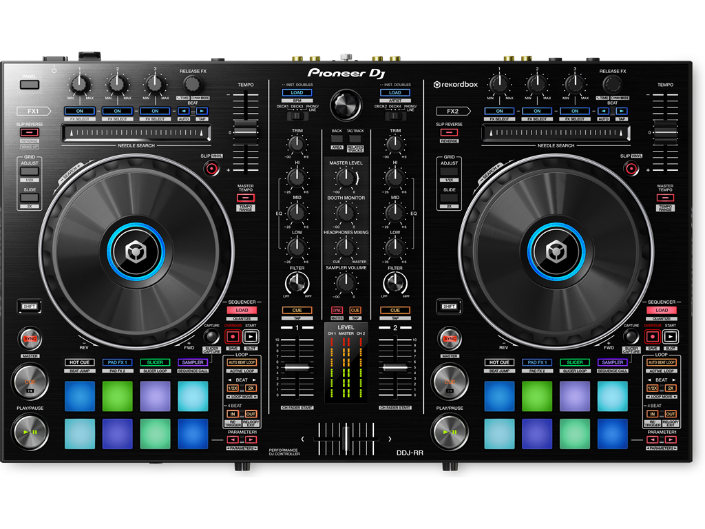
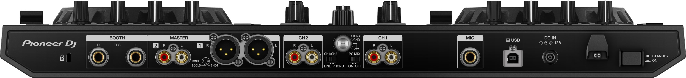

# Conociendo tu equipo





  ## 1. Teclas

  #### **1. CUE**
      ```jsx
      Vuelve al punto inicial marcado, primer bombo (golpe)
      ```

  #### **2. PLAY/PAUSE**
      ```jsx
        Arranca la canción
      ```

  #### **3. LOOPS IN - OUT** 
        ```jsx
        Tiempos: 1/4 - 1/2 - 1 - 2 - 4 - 8 - 16 - 32
        ```
  #### **4. BEATS** 
        ```jsx
        Falta probar
        ```
  #### **5. AUTOCUE** 
      ```jsx
      Activo: Cambia de cancion automaticamente
      ```
   #### **6. PITCH** 
      ```jsx
      Arriba: Coloca la cancion lenta
      Abajo: Coloca la cancion rapida
      ```

# Mexclas

  #### **1. Homologar canciones** 
      ```jsx
       Se coloca final de la cancion 1 y el princio de la cuenta2
      ```

# Efectos Sound Color FX

  #### **1. FILTER**  Barrido de frecuencia
    ```jsx
    Izquierda: Frecuencias gravas
    Derecha: Frecuencias agudas
    ```
  #### **2. CRUSH** Similar al filter pero roto
      ```jsx
       Se coloca final de la cancion 1 y el princio de la cuenta2
      ```
  #### **3. NOISE** Ruido Blanco: Lluvia
      ```jsx
         Izquierda: Disminuye
         Derecha: Aumenta
      ```
  #### **4. GATE/COMP** 
      ```jsx
         Izquierda: Cerrar sonido
         Derecha: Comprimir sonido aumento sonido
      ```
  #### **5. DUB/ECHO**  Retardo
      ```jsx
        Cuanto mas se gira mas efecto
      ```
  #### **6. SPACE**  Espacio
      ```jsx
        Sonido espacial
      ```

# Efectos de los beat de la cancion  BEAT FX, 
  ### Se usa mas en subida, puede ser cada  2 o 3 canciones


  #### **1. DELAY**  
      ```jsx
        Repeticion de los ultimos golpes
      ```
  #### **2. ECHO**  
  ```jsx
    Repeticion de los ultimos golpes + cola
  ```
   #### **3. SPIRAL**  
  ```jsx
    Repeticion de los ultimos golpes + cola
  ```
   #### **4. REVERBE**  
  ```jsx
    Repeticion de los ultimos golpes + cola
  ```
   #### **4. ROBOT**  
  ```jsx
    voz de robot en vocal 
  ```

  