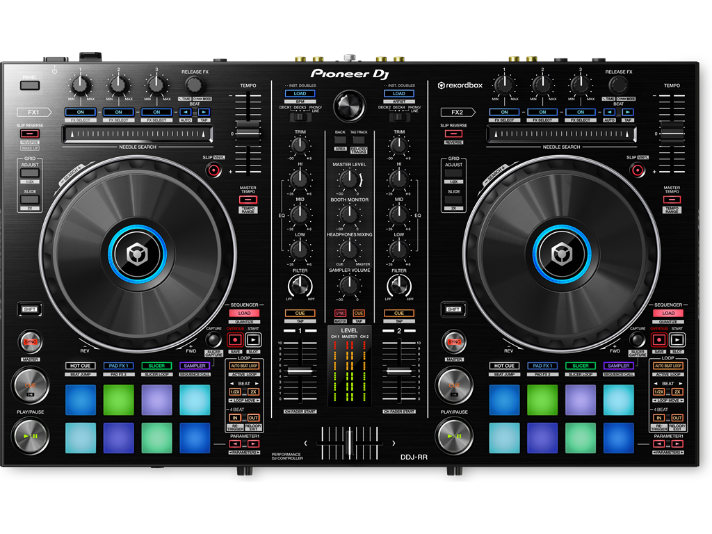
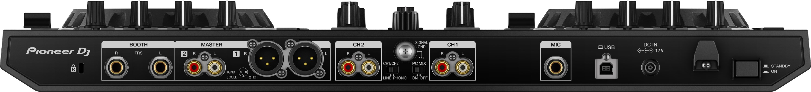

# Conociendo el software




## 1. Decks

  #### **1. Decks**
      ```jsx
      La parte mas rellenado es cuando la musica es mas intensa y la mas finita, los bajones de la canción (ausencia de bombos)
      ```

  #### **2. HOT CUES**
      ```jsx
        1. Sirven para hacer referencia a las canciones, tiene 8
        2. Un click coloca un punto, dos click inicia la cancion desde alla
      ```
  #### **3. CUE**
    ```jsx
      Sirve para escuchar el canal por los auriculares  
    ```
  #### **4. LINEA DE TIEMPO PARCIAL**
    ```jsx
      La parte superior corresponde al Deck1 (izquierda)
      La parte inferior corresponde al Deck2 (Derecha)
    ```
      
  #### **5. BPM's: Beats por minuto**
    ```jsx
        Beats= 125 Bombos en cada minuto
        Compas= 4 Bombos
        Frase: 8 compases
    ```
  
  #### **6. Indicador Bombos**
    ```jsx
        5.2 Bars
        Compas = 5
        Bombos = 2
        Segundo bombo del quinto compas
        9.1 Bars
        Inicio Frase 8 Compases = 1 Frase
        Inicio frase coincide con un compas
    ```
  #### **7. Estructura musica en carpetas menor a 200 archivos **
    ```jsx
        * Año
        * Genero
        * Trimestre
        * Bases - Cantadas - Melodias
    ```
   #### **8. Mezcla **
    ```jsx
        Final de una cancion1 con principio de cancion2
        Cancion1:Primer bombo despues de un bajon - Hot Cue corte A
        Cancion2:Primer bombo despues de un bajon antes de la primera subida

    ```
  #### **9. Equalizacion **
    ```jsx
        Agudos: frecuencia alta notas agudas
        Medios: Melodia o voz del cantante
        Bajos: Bombo, frecuencia baja, La suma de las dos debe ser 100: 
          0% + 100%, 50% + 50%, 25% + 75%
    ```
  #### **10. Mezcla basica **
  ```jsx
      ajusto bpm en ambas canciones
      Cancion Saliente: quitar protagonismo
        inicio
          agudos: 100%
          medios: 100%
          graves: 100%
          volumen: 100%
      Cancion entrante: dar protagonismo
        inicio:
          agudos: 75%
          medios: 75%
          graves: 0%
          volumen: 0%
        entrada
          subo volumen hasta llegar al 100%
          subo agudos y medios hasta llegar al 100%
          en cambio de frase invierto los graves
          quito agudos y medios de cancion saliente
          meter efecto
  ```
#### **11. Mezcla al subidon **
    ```jsx
        ajusto bpm en ambas canciones
        mezclar las canciones en el bajon, para que ambas esten mezcladas al subidon
        mezclar segundo bajon de la cancion saliente con el primero de la cancion entrante
        Beat Jump Rekordbox
        colocamos el cursor en la primera cancion en el primer bombo del segundo bajon y le damos hacia 3 bloques de 32 bombos con beat jump:3 veces al 32
        hot cue y marcamos corte A
        colocamos el cursor en la segunda cancion en el primer bombo del primer bajon y le damos hacia 3 bloques de 32 bombos con beat jump:3 veces al 32
        hot cue y marcamos corte A
        cuando se unan se baja un poco el grave de una de las canciones
    ```
#### **12. Quitar cancion saliente **
    ```jsx
      1. Siguiente bajon de la cancion entrante, se baja el volumen
      2. Ambas en el subido, y se baja subitamente el volumen la de la saliente no se tocan los equalizadores
      3. no hacer nada, cuanda ambas estan por acabar
      4. con efectos, ejemplo filterm, izq(grave), der(agudo)
      5. bajar volumen y equalizadores
    ```